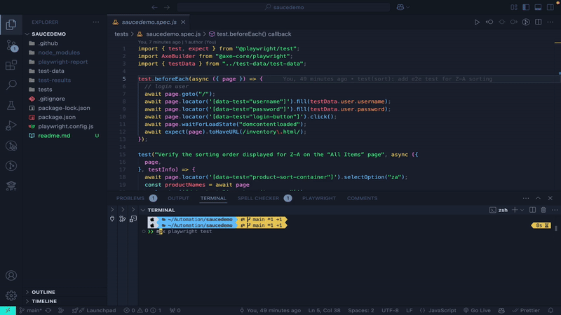
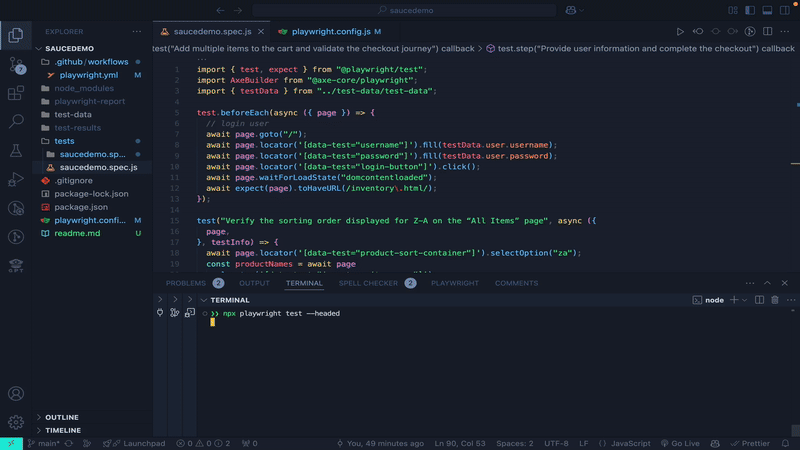
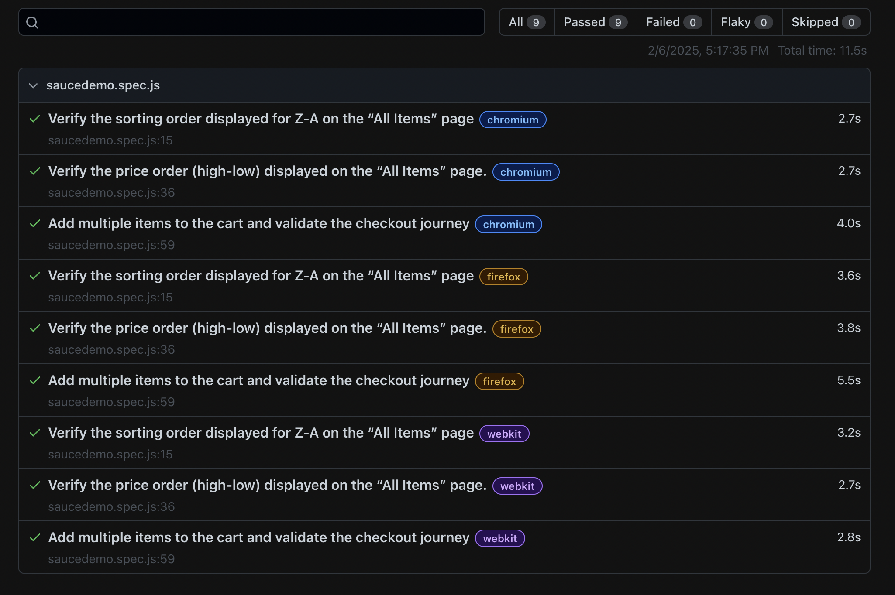

# SauceDemo Automation using Playwright

## Overview

This project is an automated test suite using Playwright to test the functionality of [SauceDemo](https://www.saucedemo.com/). It covers functional, visual, and accessibility testing.This project includes a GitHub Actions workflow to run tests automatically on push/pull request.

## Prerequisites

- **Git**
- **Node.js**: 18.x or later
- **IDE**: VS Code or other

For detailed system requirements, please check the [Playwright System Requirements](https://playwright.dev/docs/intro#system-requirements) page.

## Installation & Setup

Clone the repository:

```sh
git clone <repository-url>
cd <repository-folder>
```

Install dependencies:

```sh
npm install
```

## Running Tests

### Run Tests in Headless Mode

```sh
npx playwright test
```

### Run Tests in Headed Mode

```sh
npx playwright test --headed
```

### Run a Specific Test File

```sh
npx playwright test tests/saucedemo.spec.ts
```

### Update Baseline Snapshots

```sh
npx playwright test --update-snapshots
```

### View Test Report

```sh
npx playwright show-report
```

## Video Recording of Test Execution

- [headless run](./test-recording/headed-run.mov)
- [headed run](./test-recording/headed-run.mov)

<p float="left">
  
  
</p>

## Test Execution Reports

- [Detailed HTML Report](https://shashwatahalder01.github.io/saucedemo)


